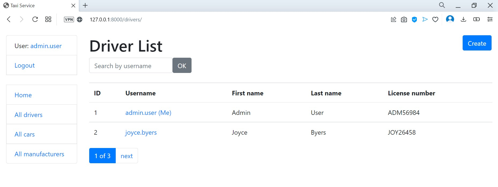

# Taxi Service

Django project for managing cars and drivers

## Check it out!

[Taxi service deployed to Render](https://akkerman-taxi-service.onrender.com/)

```shell
login: test_user
password: 1$5h4tR1
```

## Installation

Python3 must be already installed

```shell
git clone https://github.com/denlubn/taxi-service
cd taxi_service
python3 -m venv venv
source venv/bin/activate
pip install -r requirements.txt
python manage.py runserver # starts Django Server
```

## Features

* Authentication functionality for Driver/User
* Managing cars drivers & manufacturers directly from website interface
* Powerful admin panel for advanced managing

## Demo

